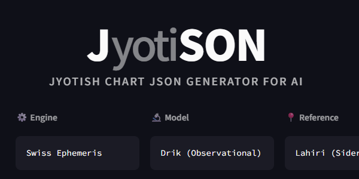

# JyotiSON

**JyotiSON** is a web application that generates structured **Vedic Astrology (Jyotish) chart data in JSON format**.  
It is engineered specifically for **LLM-driven analysis and machine interpretation**, bypassing human-centric visual displays to provide high-fidelity data.  
By delivering pre-calculated, semantically rich JSON (including lordship, aspects, and planetary strength), it **eliminates interpretive discrepancies and hallucinations**, significantly enhancing the precision of AI-powered Vedic astrology readings.

**JyotiSON** は、インド占星術（ジョーティシュ）のチャート情報を  
**LLM（大規模言語モデル）解析用途に最適化されたJSON形式**で生成する Web アプリケーションです。  
人間向けの表示ではなく、**意味構造を保ったデータ出力**を目的としています。  
出生情報から、解釈の揺れや欠落を極力減らした構造化JSONを生成することで、  
**AIによるヴェーダ占星術リーディングの精度を大きく向上させる**ことを目的としています。

---

## 🌐 Live App

- **Public URL**: https://jyotison.streamlit.app/

---

## 🎯 Use Cases / 想定用途

### English
- **Direct LLM Analysis**: Feed structured Kundali data directly into models like ChatGPT or Claude for deep, consistent reasoning.
- **Research & Validation**: Generate precise datasets for astrology experiments, backtesting, and AI prompt engineering.
- **AI Agent Backend**: Use as a reliable data engine for astrology-based AI agents or specialized diagnostic tools.

### 日本語
- **LLMによる直接解析**: ChatGPTやClaudeなどのモデルにクンダリーJSONを直接渡し、高度な推論を行わせる
- **実験・検証**: 占星術リーディングの実験用データや、AIプロンプトエンジニアリングのためのデータセット作成
- **自動化ワークフロー**: 占星術を活用したAIエージェントや診断ツールのバックエンドとしての利用

---

## 💡 Design Philosophy / 設計思想

### English
- **Logic-First**: Designed for **LLM reasoning and symbolic analysis**, not for visual presentation.
- **Zero-Calculation for AI**: Provides pre-calculated "interpretive leads" (dignity, lordship, etc.) so the AI can focus on synthesis rather than error-prone arithmetic.
- **Semantic Consistency**: Prioritizes structural clarity to ensure AI interprets planetary relationships without ambiguity.
- **Traditional Roots**: Computational logic strictly adheres to **Classical Jyotisha models**.

### 日本語
- **ロジック優先**: 人間が読むためではなく、**LLMによる推論・解析・意味理解**を最優先に設計
- **AIの計算負荷をゼロに**: 品位や支配星、アスペクト等の計算結果を明示することで、AIの計算ミスやハルシネーション（誤情報）を抑止
- **意味構造の維持**: 見た目よりも**意味的一貫性**を重視し、AIが惑星間の関係性を誤認しない構造を採用
- **伝統への準拠**: 計算ロジックは **伝統的なインド占星術（ジョーティシュ）** に基づく

---

## 🧠 Features / 主な機能

### ✅ Implemented
- **Smart Google Maps Input**: Accepts direct coordinates and Google Maps share links.
- **Automatic Spatio-Temporal Detection**: Timezone and DST detection based on birth coordinates.
- **Precise Calculations**: Sidereal zodiac (Lahiri Ayanamsa), Whole Sign house system, and Mean/True Node toggle.
- **Interpretation Aids**: Automatic detection of Dignity (Exalted, Debilitated, Moolatrikona, etc.), Aspects, and Combustion.
- **Advanced Indicators**: Planetary speed (Stationary, Fast, etc.), Dig Bala, and Vargottama status.
- **Jaimini System**: Chara Karaka (7/8 schemes), Karakamsha, AL (Arudha Lagna), and UL (Upapada Lagna).
- **Comprehensive Vargas**: Support for 10+ divisional charts (D1, D3, D4, D7, D9, D10, D12, D16, D20, D24, D30, D60).
- **Vimshottari Dasha**: Full life cycle (MD) and detailed current context (AD) with past/current/future tagging.

### ✅ 実装済み

- **Googleマップ入力の最適化**: 座標数値・Googleマップ共有リンクの貼り付けに対応。  
- **UTCオフセットの自動判定**: 出生地・時刻からのタイムゾーンおよび夏時間の自動判定
- **精密な計算ロジック**: 恒星黄道（Lahiri Ayanamsa）、Whole Sign ハウスシステム、Mean/True Node 切り替え
- **解釈の補助線**: 品位（高揚・減衰、ムーラトリコーナ等）、アスペクト、コンバストの自動判定
- **高度な指標**: 惑星スピード（静止・高速等）、ディグ・バラ、ヴァルゴッタマ判定
- **ジャイミニ占星術**: チャラ・カーラカ、カラカムシャ、AL、UL の算出
- **豊富な分割図**: 主要な10種類以上の分割図に対応（D1, D3, D4, D7, D9, D10, D12, D16, D20, D24, D30, D60）
- **ヴィムショッタリ・ダシャー**: 一生の大きな流れ（MD）と、現在と前後数年の詳細な流れ（AD）をタグ付きで出力

---

## 🗂 Project Structure / 構成

```text
.
├─ streamlit_app.py
├─ ui/
│  ├─ i18n.py             # 翻訳辞書（EN / JP）
│  ├─ geo_timezone.py     # geo_paste / lat-lon / tz auto-manual 状態遷移
│  └─ presets.py          # Output preset (Basic / Standard / Advanced / Custom)
├─ input/
│  └─ location.py         # Google Maps 座標 / 共有リンクのパース
├─ output/
│  └─ filters.py          # apply_output_options（出力マスク）
├─ calc/
│  ├─ __init__.py
│  ├─ timezone.py         # 緯度経度 + datetime → TZ/DST/offset
│  ├─ base.py             # 定数・基本定義（SIGNS, PLANETS 等）
│  ├─ ephemeris.py        # Swiss Ephemeris wrapper
│  ├─ panchanga.py        # Tithi / Paksha / Nakshatra
│  ├─ speed.py            # Speed / station / very fast 判定
│  ├─ enrich.py           # lord, aspect, dignity, combust, dig bala 等
│  ├─ jaimini.py          # Chara Karaka, Karakamsha, AL, UL
│  ├─ varga.py            # 共通分割図ビルダー（D3–D60）
│  ├─ d1.py               # D1 Rashi
│  ├─ d9.py               # D9 Navamsa
│  ├─ dasha.py            # Vimshottari Dasha
│  └─ validators.py       # prune_and_validate / schema 検証
└─ requirements.txt
```
---

## ⚙️ Technical Specs / 技術仕様

- Python: 3.11
- Framework: Streamlit 1.54.0
- Ephemeris: Swiss Ephemeris (pyswisseph 2.10.3.2)

---

## 📦 Output Format / 出力形式

- JSON only
- Stable, explicit keys for LLM parsing
- No UI-oriented abbreviations
- Semantic meaning preserved even if verbose

### 日本語

- 出力は JSONのみ
- LLMが誤解しにくい 明示的なキー設計
- UI向けの省略表記は使用しません
- 冗長でも 意味の保存を優先します

---

## Output Sample / 出力例（抜粋）

```json
{
  "schema": "kundali_llm_v1",
  "generator": {
    "tool": "JyotiSON",
    "version": "1.0",
    "purpose": "LLM_vedic_astrology_analysis"
  },
  "birth_data": {
    "name": "Guest",
    "birth": "1990-01-01T12:00:00+09:00"
  },
  "charts": {
    "D1": {
      "Asc": { "sign": "Ar", "degree": 0.01, "nakshatra": { "name": "Ashwini", "pada": 1, "lord": "Ke" } },
      "planets": {
        "Ma": {
          "sign": "Sc", "degree": 16.02, "house": 8,
          "dignity": "owned"
        },
        "Ju": {
          "sign": "Ge", "degree": 11.48, "house": 3, "retrograde": true,
          "dignity": "enemy"
        },
        "Sa": {
          "sign": "Sg", "degree": 21.89, "house": 9, "combust": true, "dignity": "neutral"
        }
        //...
      },
      "jaimini": {
        "AK": "Sa", "AmK": "Su", //...,
        "arudha_lagna": "Ge"
      },
      "derived": {
        "vargottama": ["Ma", "Me"],
        "lordship_to_houses": { "Ma": [1, 8], "Ju": [9, 12], "Sa": [10, 11] }
        //...
      }
    },
    "D9": {
      "Asc": { "sign": "Ar" },
      "planets": {
        "Ju": { "sign": "Cp", "house": 10, "dignity": "debilitated" },
        "Sa": { "sign": "Li", "house": 7, "dignity": "exalted" }
        //...
      }
    },
    "D10": {
      "Asc": { "sign": "Ar" },
      "planets": {
        "Me": { "sign": "Vi", "house": 6, "dignity": "exalted" }
        //...
      }
    }
  },
  "dasha": {
    "system": "Vimshottari",
    "current_context": {
      "current_maha": "Sa",
      "current_antar": "Sa",
      "current_sequence": [
        { "lord": "Ra", "start": "2022-09-26", "label": "past_1" },
        { "lord": "Sa", "start": "2025-02-18", "label": "current" },
        { "lord": "Me", "start": "2028-02-22", "label": "future_1" }
      ]
    }
  }
}
```
---

## 📜 License

MIT License

---

## ✨ Notes

JyotiSON is an experimental and research-oriented project.
Astrological correctness is prioritized, but interpretations are intentionally not included.

JyotiSON は研究・実験的プロジェクトです。
計算の正確性は重視していますが、解釈文は意図的に含めていません。